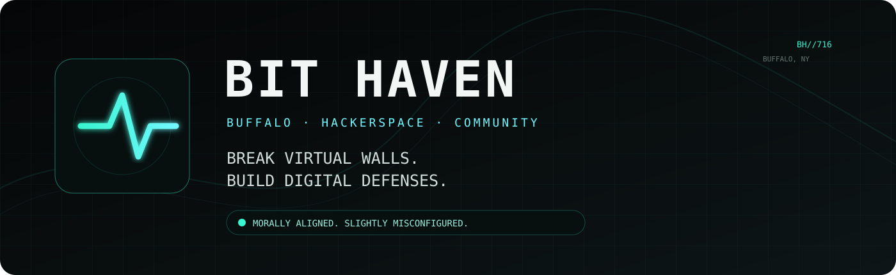
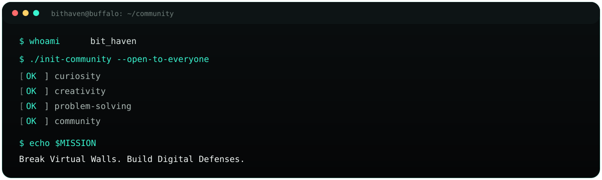
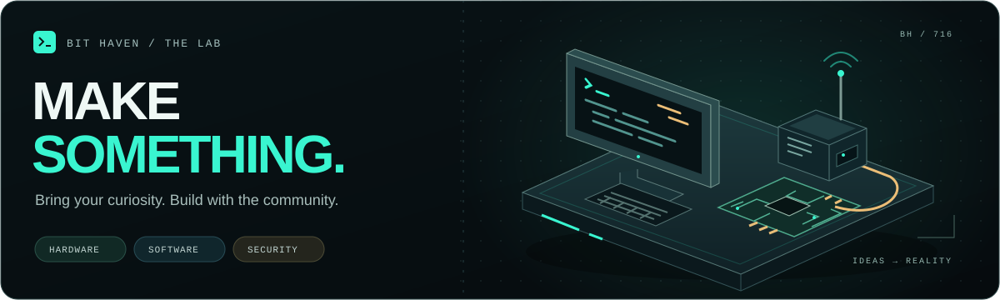
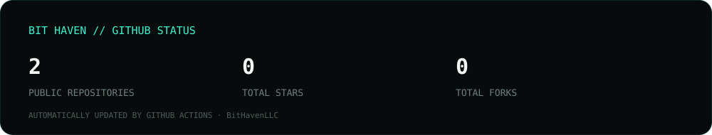

 

---

## Bit Haven

**Buffalo's hackerspace open to everyone.**

Bit Haven is a place for exploration, creativity, problem-solving, cybersecurity, technology, and community — from beginner to L33t. This organization is the open-source home for the projects, tools, infrastructure, and experiments built around the space.

> **Break Virtual Walls. Build Digital Defenses.**

## What lives here

<table>
<tr>
<td width="50%">

### Cybersecurity

CTFs, security research, OSINT, defensive tooling, DFIR, and experiments.

</td>
<td width="50%">

### Software

Community applications, automation, bots, services, and open-source tooling.

</td>
</tr>
<tr>
<td width="50%">

### Hardware

Raspberry Pi, ESP32, Arduino, electronics, radio, and physical computing.

</td>
<td width="50%">

### Infrastructure

Networking, self-hosting, monitoring, services, and hackerspace infrastructure.

</td>
</tr>
</table>

## Open source

Projects here are built by the Bit Haven community. Some will be polished. Some will be experimental. All of them are opportunities to learn, collaborate, and build something useful.

If you find something interesting:

- Open an issue when something is broken.
- Start a discussion when you have an idea.
- Fork a project when you want to experiment.
- Open a pull request when you have something worth contributing.

You don't need to already be an expert to participate.

## GitHub status

## Community

Bit Haven is bigger than the code in this organization. The hackerspace is a physical community in **Buffalo, New York** built around people learning from one another and making things together.

  

**BIT HAVEN LLC · BUFFALO, NEW YORK**

Morally Aligned. Slightly Misconfigured.

